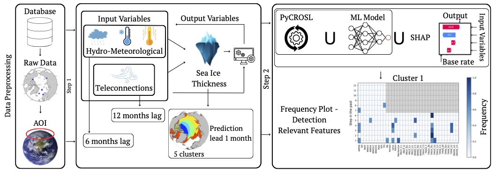

# Interpretable-Feature-Selection-for-Arctic-Sea-Ice-Thickness
PyCROSL + SHAP framework
This repository contains the code and experiments supporting the paper:
Interpretable Feature Selection for Arctic Sea Ice Thickness
E. Poli, A. Iseni

## Overview
Understanding the drivers of Arctic Sea Ice Thickness (SIT) is challenging due to the large number of correlated meteorological, hydrological, and climate predictors involved.
This repository implements an interpretable feature selection framework that combines:

- PyCROSL: an evolutionary optimization algorithm inspired by coral reef dynamics
- SHAP (SHapley Additive exPlanations): used as an internal regularization mechanism to guide feature selection toward coherent and interpretable subsets.

The framework is applied to clustered Arctic regions and evaluates different feature selection strategies under varying constraints.

## Methodological Summary

#### 1. Data preprocessing
- Monthly aggregation of heterogeneous datasets
- Construction of lagged predictors (6–12 months)
- Standardization and imputation
#### 2. Spatial clustering
PIOMAS sea ice thickness fields clustered into five homogeneous Arctic regions using K-means
#### 3. Feature selection
- PyCROSL (baseline configuration)
- PyCROSL with SHAP-guided fitness
- Fixed-cardinality variants (N = 10)
#### 4. Post-selection validation
- Retraining LightGBM models on stable feature subsets
- Independent evaluation of predictive skill

## PyCROSL Dependency

This project builds upon the official **PyCROSL** implementation:

🔗 [https://github.com/GheodeAI/PyCROSL/tree/main/PyCROSL  ](https://github.com/GheodeAI/PyCROSL/tree/main)

The original PyCROSL framework is described in:

Pérez-Aracil, J., Camacho-Gómez, C., Lorente-Ramos, E., Marina, C. M., Cornejo-Bueno, L. M., & Salcedo-Sanz, S. (2023).  
*New probabilistic, dynamic multi-method ensembles for optimization based on the CRO-SL.*  
Mathematics, 11(7), 1666. https://doi.org/10.3390/math11071666

### Important Note

The files contained in the `Algorithm_settings/` directory of this repository **do not include the full PyCROSL framework**.

They only contain a **modified version of the main execution script**, adapted to:

- Integrate the different SHAP-based alignment regularization term  
- Implement the fitness configurations described in the paper  
- Run the Arctic SIT feature selection experiments  

To execute the algorithm correctly, it is necessary to clone or install the complete PyCROSL framework from the official repository linked above.

The modified `main` script provided here is intended to be used **together with the full PyCROSL source code**, and is not a standalone implementation.
